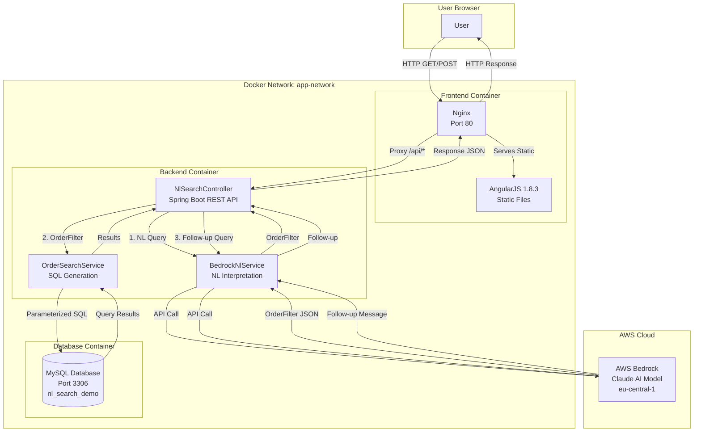
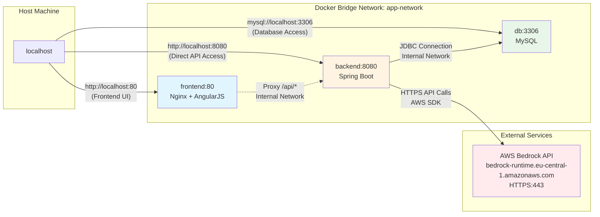
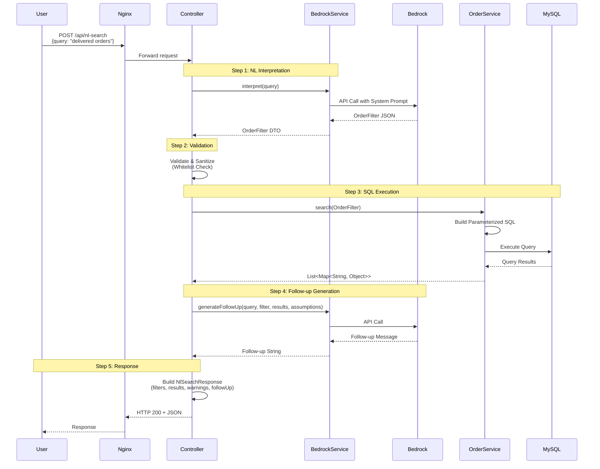

# AI-Powered Natural Language Search

## System and API Design

**Architecture**: Three-tier system with frontend (compatible with Angular 1.8.3), backend (Spring Boot), and database (MySQL) plus Dockerization and AWS Bedrock integration.

### System Architecture Diagram



### Network Diagram



### Component Interaction Flow



**API Flow**:
1. `POST /api/nl-search` receives natural language query
2. `BedrockNlService` converts NL → `OrderFilter` JSON via AWS Bedrock
3. `NlSearchController` validates and sanitizes filter
4. `OrderSearchService` converts `OrderFilter` → parameterized SQL
5. Results + warnings + follow-up message returned

**Key Design Decisions**:
- **Structured intermediate format** (`OrderFilter` DTO) separates NL interpretation from SQL generation
- **Exclusion-based status filtering** (exclude unwanted statuses) simplifies "show X" queries
- **Two-stage validation**: Bedrock output validated against whitelists before SQL execution
- **Follow-up message generation** explains assumptions and suggests alternatives

## Natural Language to Structured Query Translation

**Process**:
1. **Prompt Engineering**: System prompt provides database schema, valid values, interpretation rules, and examples
2. **Context Injection**: Current date, relative date calculations (last week, yesterday) injected into prompt
3. **JSON Extraction**: Response parsed with regex fallbacks for code blocks or wrapped JSON
4. **Validation**: Controller validates all enum values against whitelists

**Translation Strategy**:
- **Explicit rules** for ambiguous terms (e.g., "shipped" → DELIVERED status)
- **Relative date resolution** (e.g., "last week" → absolute dates using current date)
- **Default assumptions** tracked (e.g., date field defaults to CREATED if unspecified)
- **Combination logic**: Status filters use OR (exclude all except specified), other filters use AND

**Example**: "delivered orders collected by operator" → `exclude_status: [all except DELIVERED]` AND `collected_by: [OPERATOR]`

## Security Considerations

### Prompt Injection Prevention
- **System prompt isolation**: User query separated from system instructions in message structure
- **Output validation**: All Bedrock outputs validated against strict whitelists (statuses, services, location types)
- **No direct SQL generation**: Bedrock only produces structured JSON, never SQL strings
- **Input sanitization**: Query trimmed and validated for empty/null before processing

### SQL Injection Prevention
- **Parameterized queries**: All user-derived values passed as `?` placeholders via `JdbcTemplate`
- **No string concatenation**: SQL built with `StringBuilder` but values never interpolated
- **Whitelist validation**: Enum values (status, service, location_type) validated against sets before SQL construction
- **Type safety**: Date values validated as YYYY-MM-DD format before use

**Trade-off**: Whitelist validation limits flexibility but prevents injection. Unknown values generate warnings rather than errors.

## Code Structure and Trade-offs

**Layered Architecture**:
- `controller/`: Request handling, validation, error responses
- `service/`: Business logic (NL interpretation, SQL generation)
- `dto/`: Data transfer objects (`OrderFilter`, `NlSearchResponse`)

**Key Trade-offs**:

1. **Exclusion-based status filtering**: 
   - Pro: Simplifies "show X" queries (exclude all except X)
   - Con: More complex for "show X and Y" (exclude all except X,Y)

2. **Assumption tracking**:
   - Pro: Transparent to users about defaults (date field, status interpretation)
   - Con: Additional complexity in controller validation logic

3. **Follow-up message generation**:
   - Pro: Improves UX by explaining assumptions and suggesting alternatives
   - Con: Additional Bedrock API call increases latency and cost

4. **Whitelist validation**:
   - Pro: Prevents injection, provides clear error messages
   - Con: Requires maintenance when schema changes

## Edge Cases and Ambiguity Handling

**Date Ambiguity**:
- Relative dates ("last week", "yesterday") resolved using current date context
- Date field defaults to CREATED if unspecified; assumption tracked and communicated
- "Delivered" queries automatically use STORED date field (delivery = storage event)

**Status Ambiguity**:
- "Shipped" → DELIVERED status (assumption tracked)
- "Operator-collected" can mean status OR collected_by field; context determines interpretation
- Multiple statuses with "and" → OR logic (exclude all except listed statuses)

**Location/Company/Carrier Ambiguity**:
- Partial matching via SQL `LIKE` for names (allows typos, partial names)
- Exact matching for enums (location_type, city) prevents false positives
- Empty results trigger follow-up suggestions with valid alternatives

**Flag Handling**:
- Flags stored as comma-separated strings; uses `FIND_IN_SET()` for matching
- Handles NULL flags (excluded items have no flags)

**Error Handling**:
- Bedrock failures → generic error message (prevents prompt leakage)
- Invalid enum values → warnings, filtered out (graceful degradation)
- JSON parsing failures → regex extraction fallback
- AWS credential errors → specific error message for configuration issues

**Empty Results**:
- Follow-up message suggests valid alternatives (locations, time periods)
- Distinguishes between invalid values vs. valid values with no matches

## Prerequisites

- Docker and Docker Compose
- AWS Account with Bedrock access
- AWS Credentials (Access Key ID and Secret Access Key)

## Setup

### 1. Configure AWS Credentials

**Option 1: Environment variables (recommended for Docker)**
Create a `.env` file in the root directory:
```bash
AWS_ACCESS_KEY_ID=your-access-key-id
AWS_SECRET_ACCESS_KEY=your-secret-access-key
AWS_REGION=eu-central-1
```

**Option 2: Pass directly to docker-compose**
```bash
AWS_ACCESS_KEY_ID=your-key AWS_SECRET_ACCESS_KEY=your-secret docker-compose up
```

**Option 3: AWS credentials file (for local development)**
Configure `~/.aws/credentials` on your host machine.

### 2. Run with Docker Compose

```bash
docker-compose up --build
```

This will start:
- **Frontend**: http://localhost:80
- **Backend**: http://localhost:8080
- **Database**: MySQL on port 3306

## Troubleshooting

### "Unable to understand your query" Error

This error typically means:
1. **AWS credentials are not configured** - Check that AWS_ACCESS_KEY_ID and AWS_SECRET_ACCESS_KEY are set
2. **AWS Bedrock access denied** - Ensure your AWS account has access to Bedrock in the eu-central-1 region
3. **Network issues** - Check that the backend container can reach AWS Bedrock API

Check the backend logs for detailed error messages:
```bash
docker-compose logs backend
```

## Development

### Building Individual Services

- **Backend**: `docker build ./backend`
- **Frontend**: `docker build ./frontend`
- **Database**: `docker build ./db`
